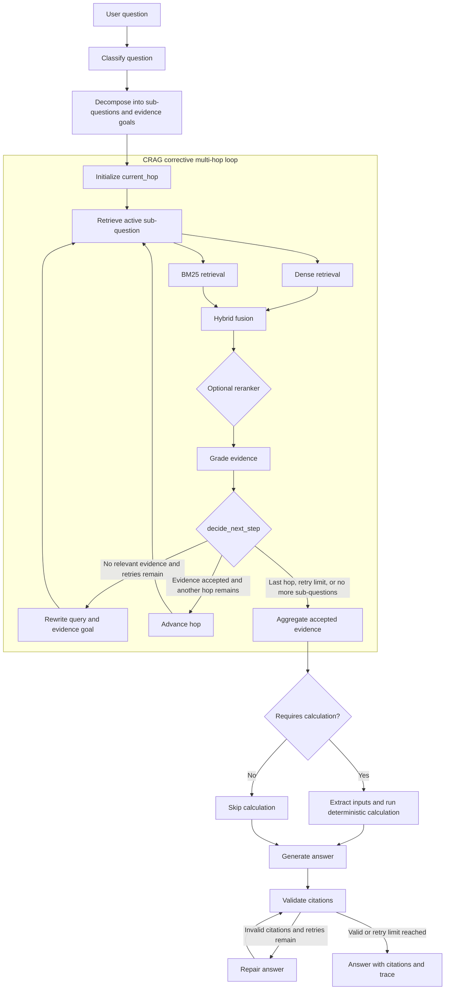

# FinSight

## Overview

FinSight is an evidence-grounded financial question-answering system for the FinanceBench benchmark. The system indexes financial filings, retrieves relevant evidence with hybrid dense and BM25 search, performs **corrective multi-hop reasoning**, generates answers with citations, and evaluates retrieval and answer quality.

## Table of Contents

- [Overview](#overview)

- [Download and Ingest](#download-and-ingest)

- [CRAG Multi-hop Pipeline](#crag-multi-hop-pipeline)

- [Evaluation](#evaluation)

- [Deployment](#deployment)
  - [Conventional Deployment](#conventional-deployment)
  - [Docker Deployment](#docker-deployment)

- [Citation](#citation)

- [License](#license)

## Download and Ingest

### Requirements

The project requires Python 3.11 or newer. A GPU is recommended for local model inference and is required by the default local GPT-OSS evaluation backend.

Create and activate a virtual environment:

```bash
python3.11 -m venv .venv
source .venv/bin/activate
python -m pip install --upgrade pip
pip install -e .
```

For GGUF inference, install the optional dependency:

```bash
pip install -e '.[gguf]'
```

Create the environment configuration:

```bash
cp .env.example .env
```

The main configuration values are:

- `CHROMA_PERSIST_DIR`: persistent ChromaDB directory.

- `EMBEDDING_MODEL`: embedding model used for dense retrieval.

- `RERANKER_MODEL`: optional cross-encoder reranker.

- `USE_RERANKER`: enables or disables reranking.

- `TOP_K_DENSE`, `TOP_K_BM25`, and `TOP_K_HYBRID`: retrieval sizes.

- `GROQ_API_KEY` and `MODEL_NAME`: model configuration for the configured answer pipeline.

- `HF_TOKEN`: optional Hugging Face access token.

### Download the dataset

```bash
python scripts/download_dataset.py
```

The default command stores the FinanceBench metadata and PDF files under the project data directory.

### Build the indexes

```bash
python scripts/ingest.py
```

To rebuild the indexes from scratch:

```bash
python scripts/ingest.py --force
```

The ingestion command creates:

- A persistent ChromaDB vector collection for semantic retrieval.

- A BM25 artifact at `data/index/bm25.pkl` for lexical retrieval.

- Ingestion state and manifest files for reproducibility.

Validate the generated indexes with:

```bash
python scripts/check_index.py
```

Download the default embedding and reranker models when needed:

```bash
python scripts/download_models.py
```

Download the default GGUF model for local evaluation:

```bash
python scripts/download_llm.py \\
  --repo-id unsloth/gpt-oss-20b-GGUF \\
  --filename gpt-oss-20b-Q4_K_M.gguf
```

## CRAG Multi-hop Pipeline

The CRAG pipeline is implemented as a LangGraph workflow in `src/graph/workflow.py` and `src/graph/nodes.py`. It is not a single-pass retrieve-and-answer pipeline. The graph decomposes a question into sub-questions, evaluates the evidence after each retrieval attempt, rewrites weak queries, and advances through multiple hops while preserving accepted evidence.



The key corrective loop is controlled by `decide_next_step`:

- When no relevant evidence is accepted and retries remain, `rewrite_query` changes the active query and starts retrieval again.

- When the current hop has usable evidence and another sub-question remains, `advance_hop` moves to the next hop.

- When the hop limit or retry limit is reached, `aggregate_evidence` deduplicates the accepted evidence before answer generation.

- If the question requires arithmetic, the model selects the calculation inputs and a deterministic Python function computes the result.

- After answer generation, citation validation can repair unsupported claims before the final response is returned.

## Evaluation

FinSight uses a two-pass evaluation workflow implemented in `scripts/run_eval.py`.

### Pass 1: generate answers

Pass 1 runs the retrieval and answer-generation pipeline and saves an intermediate checkpoint:

```bash
python scripts/run_eval.py \
  --phase generate \
  --backend gguf \
  --model models/gpt-oss-20b-Q4_K_M.gguf \
  --questions data/raw/financebench_open_source.jsonl \
  --artifact-dir data/index \
  --output-dir results \
  --config-name gpt-oss-20b-gguf-two-pass
```

For a smoke test, limit the number of questions:

```bash
python scripts/run_eval.py \\
  --phase generate \\
  --limit 2 \\
  --run-metrics retrieval,citation
```

### Pass 2: evaluate the checkpoint

Pass 2 loads the Pass 1 checkpoint and evaluates the existing answers. It does not regenerate them:

```bash
python scripts/run_eval.py \
  --phase judge \
  --backend gguf \
  --judge-model models/gpt-oss-20b-Q4_K_M.gguf \
  --samples-path results/gpt-oss-20b-gguf-two-pass_pass1.json \
  --questions data/raw/financebench_open_source.jsonl \
  --artifact-dir data/index \
  --output-dir results \
  --run-metrics retrieval,citation,ragas
```

Use the same question file and filters in Pass 2 that were used in Pass 1, including `--limit`, `--company`, `--question-type`, `--shuffle`, and `--seed`.

To evaluate retrieval and citations without Ragas generation metrics:

```bash
python scripts/run_eval.py \\
  --phase judge \\
  --samples-path results/pass1_checkpoint.json \\
  --questions data/raw/financebench_open_source.jsonl \\
  --run-metrics retrieval,citation
```

The evaluation reports contain the following metric groups:

| Metric group | Description |
| --- | --- |
| Retrieval | Measures whether relevant documents and pages are retrieved at different values of `k`. |
| Citation | Measures citation coverage and citation validity against the accepted evidence. |
| Ragas generation | Measures faithfulness, answer relevancy, answer correctness, context precision, and context recall. |

The generation metrics require substantial compute because the local judge evaluates each answer and produces structured intermediate outputs. **The available resources may be insufficient to run generation metrics reliably. In particular, using a very small model such as Qwen 8B usually produces poor judging outputs and consequently very poor or unreliable generation scores.** When resources are limited, run retrieval and citation metrics first, or use a stronger judge model with a smaller evaluation subset.

Evaluation outputs are written to `results/`.

## Deployment

### Conventional Deployment

After completing dataset download and ingestion, start the FastAPI backend:

```bash
uvicorn src.main:app --host 0.0.0.0 --port 8000
```

Check the service and index status:

```bash
curl http://localhost:8000/health
```

The backend exposes:

- `GET /health`: service and index health information.

- `GET /debug/retrieve?q=...`: retrieval-only debugging endpoint.

- `POST /query`: complete question-answering endpoint.

Example retrieval debugging request:

```bash
curl --get http://localhost:8000/debug/retrieve \\
  --data-urlencode 'q=What was the revenue in fiscal year 2023?' \\
  --data 'top_k=10'
```

Start the Streamlit interface in another terminal:

```bash
streamlit run ui/streamlit_app.py --server.port 8501
```

The application is then available at `http://localhost:8501`, while the API is available at `http://localhost:8000`.

### Docker Deployment

Create `.env` from `.env.example`, then start all services:

```bash
cp .env.example .env
docker compose up --build
```

The Compose setup contains three services:

- `index-init` downloads the dataset and builds the indexes when valid indexes do not already exist.

- `backend` serves the FastAPI application on port `8000`.

- `frontend` serves the Streamlit interface on port `8501`.

The `data/` and `logs/` directories are mounted as volumes so indexes and logs persist outside the containers.

## Citation

If you use FinSight or the FinanceBench benchmark, cite the original FinanceBench publication:

```
@misc{islam2023financebench,
      title={FinanceBench: A New Benchmark for Financial Question Answering},
      author={Pranab Islam and Anand Kannappan and Douwe Kiela and Rebecca Qian and Nino Scherrer and Bertie Vidgen},
      year={2023},
      eprint={2311.11944},
      archivePrefix={arXiv},
      primaryClass={cs.CL}
}
```

## License

See [`LICENSE`](LICENSE) for the project license.

## References

[1]: [FinanceBench: A New Benchmark for Financial Question Answering](https://arxiv.org/abs/2311.11944) 
